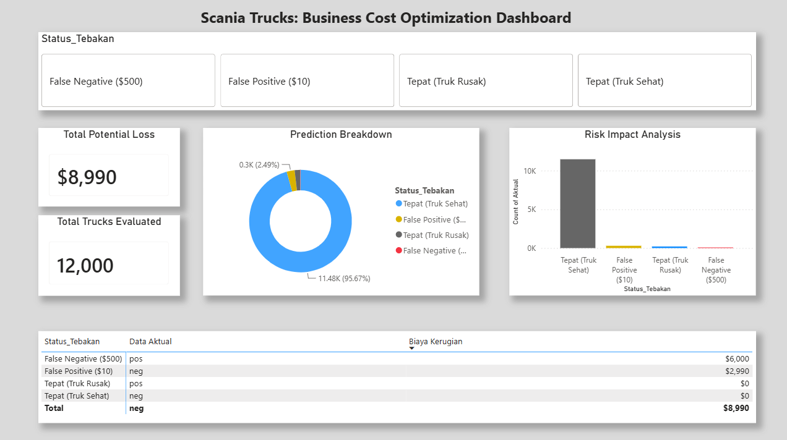
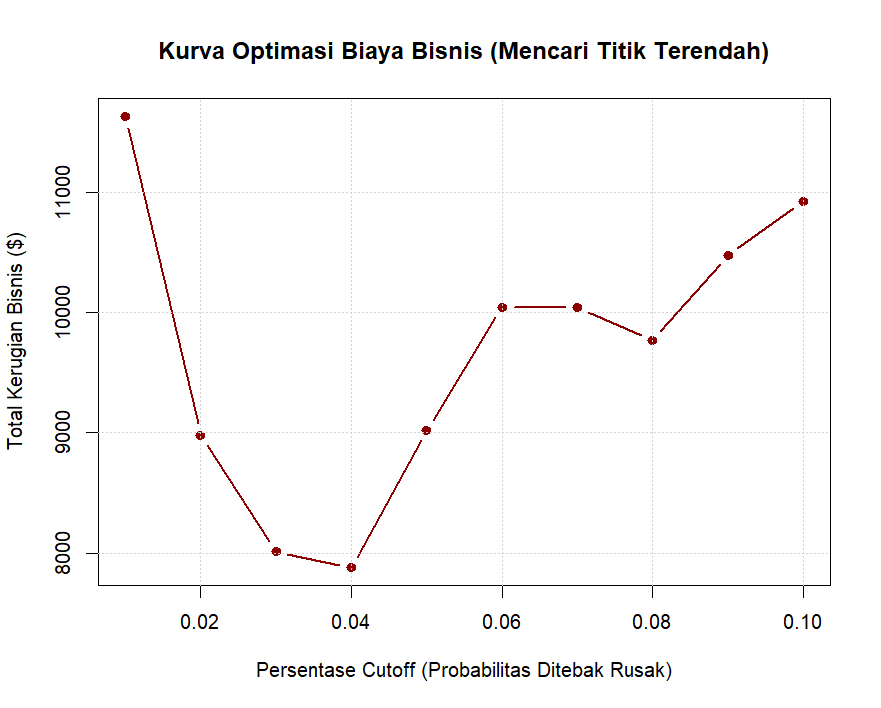
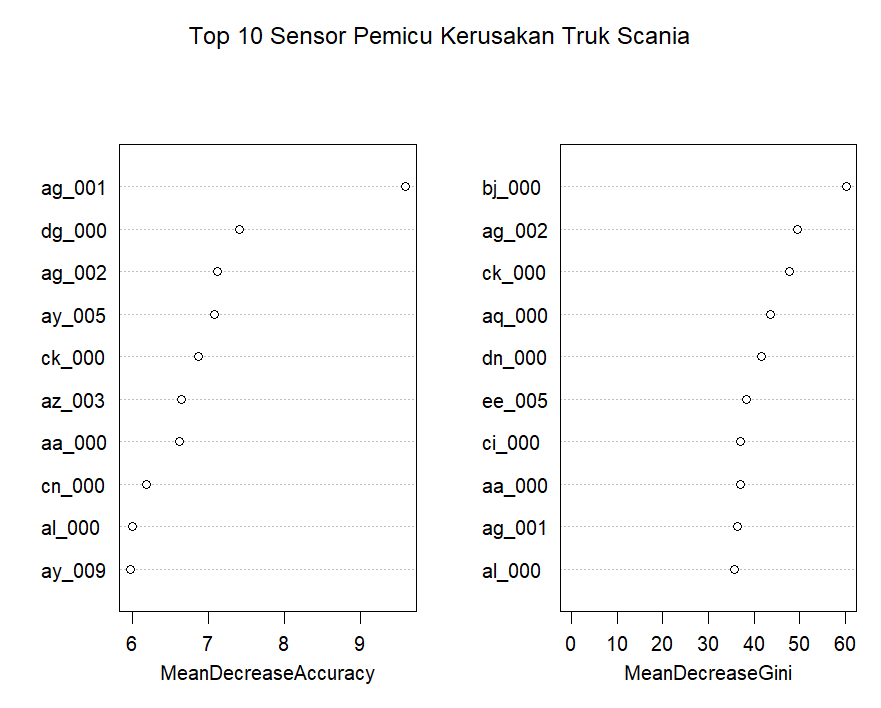

# 🚜 Predictive Maintenance & Cost Optimization for Heavy Equipment (Scania Trucks)

## 📌 Business Objective
In heavy industry and mining operations, sudden equipment failure leads to significant downtime and extreme financial loss. The objective of this project is to develop a machine learning model that predicts Air Pressure System (APS) failures in Scania heavy trucks. 

More importantly, this project goes beyond standard accuracy metrics and focuses on **Business Cost Optimization**—translating model predictions into actual business savings by minimizing false positives (unnecessary mechanical checks) and false negatives (sudden breakdowns in the field).

## 🗂️ Dataset & Domain
The dataset consists of highly complex operational sensor data from Scania trucks. 
- **Source**: [APS Failure at Scania Trucks Data Set (UCI / Kaggle)](https://archive.ics.uci.edu/ml/datasets/APS+Failure+at+Scania+Trucks)
- **Characteristics**: The data is highly imbalanced (healthy trucks heavily outnumber failing trucks) and contains a massive amount of missing sensor values, mimicking real-world industrial telemetry data. *(Note: The raw dataset is excluded from this repository due to size limits, but prediction results are provided).*

## 🛠️ Methodology & Tech Stack
- **Language**: R
- **Key Libraries**: `dplyr`, `readr`, `randomForest`
- **Analytical Process**:
  1. **Data Pre-processing**: Handled missing values by dropping severely corrupted sensors (>50% missing data) and imputing the remaining numerical data using the median.
  2. **Baseline Model**: Logistic Regression.
  3. **Advanced Modeling**: Random Forest.
  4. **Imbalanced Data Handling**: Evaluated Class Weighting (Penalizing the algorithm), which ironically increased business costs.
  5. **Threshold Tuning (Cost Optimization)**: Iteratively adjusted the decision boundary (probability cutoff) to find the absolute global minimum for maintenance costs.

## 📉 Business Impact & Cost Optimization
In this specific operational domain, prediction errors have quantifiable costs:
- **Cost 1 (False Positive)**: $10 (Unnecessary inspection time by a mechanic).
- **Cost 2 (False Negative)**: $500 (Truck breaks down during operation, causing major disruption).

By performing systematic threshold tuning, the operational cost was successfully minimized:
- Baseline Standard Model Cost: **$38,610**
- Class-Weighted Model Cost: **$59,630**
- **Optimized Cutoff Model Cost (4% Threshold): $7,880**

**Result: The threshold-optimized model saved the company approximately 79% in potential maintenance costs compared to the standard machine learning approach.**

### Cost Optimization Curve

*The curve above demonstrates the iterative algorithmic search for the minimum business cost, landing optimally at a 4% probability threshold.*

## ⚙️ Sensor Feature Importance

*The plot above shows the top 10 most critical sensors. Identifying sensors like `ag_001` and `bj_000` as the strongest indicators of APS failure provides actionable insights for the mechanical maintenance team to prioritize their physical inspections.*
